# Projektdokumentation - Procrastinator Buddy

## Inhaltsverzeichnis

1. [Ausgangslage](#1-ausgangslage)
2. [Lösungsidee](#2-lösungsidee)
3. [Vorgehen & Artefakte](#3-vorgehen--artefakte)
    1. [Understand & Define](#31-understand--define)
    2. [Sketch](#32-sketch)
    3. [Decide](#33-decide)
    4. [Prototype](#34-prototype)
    5. [Validate](#35-validate)
4. [Erweiterungen](#4-erweiterungen)
5. [Projektorganisation](#5-projektorganisation)
6. [KI-Deklaration](#6-ki-deklaration)
7. [Anhang](#7-anhang)

## 1. Ausgangslage

- **Problem:** Viele Studierende und Lernende haben Schwierigkeiten, ihre Aufgaben zu organisieren und konzentriert daran zu arbeiten. Häufig werden Aufgaben aufgeschoben, Deadlines verpasst oder der Überblick über den eigenen Fortschritt geht verloren. Zusätzlich fehlt oft eine motivierende Komponente, welche die Nutzer langfristig bei der Zielerreichung unterstützt.

- **Ziele:** 
* Aufgaben einfach verwalten können
* Fokus und Konzentration fördern
* Prokrastination reduzieren
* Motivation durch Gamification erhöhen
* Soziale Unterstützung durch Buddies ermöglichen
* Herausforderungen (Challenges) zur zusätzlichen Motivation anbieten

- **Primäre Zielgruppe:** Studierende, Lernende und Personen, die ihre Produktivität steigern und Prokrastination reduzieren möchten.

## 2. Lösungsidee
- **Kernfunktionalität:** Die Webapplikation „Procrastinator Buddy“ kombiniert klassisches Task-Management mit Fokus-Techniken und Gamification.

Die wichtigsten Funktionen sind:
* Aufgaben erstellen, bearbeiten und löschen
* Prioritäten und Deadlines vergeben
* Fokus-Sessions durchführen
* XP sammeln und Levels erreichen
* Badges freischalten
* Buddies hinzufügen
* Challenges mit Buddies erstellen
* Challenge-Gewinne und Verluste verfolgen

- **Annahmen:** Folgende Hypothesen wurden überprüft:
* Gamification erhöht die Motivation.
* Fokus-Timer helfen bei der Konzentration.
* Soziale Verantwortung durch Buddies reduziert Prokrastination.
* Challenges erhöhen die Verbindlichkeit.

- **Abgrenzung:** Nicht Bestandteil des Projekts:
* Benutzerregistrierung
* Login-System
* Echte Buddy-Einladungen
* Push-Benachrichtigungen
* Echtzeit-Kommunikation

## 3. Vorgehen & Artefakte

### 3.1 Understand & Define
- **Zielgruppenverständnis:** Die Zielgruppe besteht primär aus Studierenden und Lernenden, welche regelmässig Aufgaben organisieren und konzentriert bearbeiten müssen.

Während der Recherche wurde festgestellt, dass viele Personen:
* Aufgaben aufschieben
* Motivation verlieren
* Schwierigkeiten haben, grosse Aufgaben zu beginnen
* Von Gamification-Elementen profitieren

- **Wesentliche Erkenntnisse:** 
* Motivation ist ein zentraler Faktor.
* Fortschritt sollte sichtbar sein.
* Aufgaben müssen einfach erstellt werden können.
* Fokus-Techniken werden positiv wahrgenommen.
* Soziale Verpflichtungen können die Produktivität steigern.

### 3.2 Sketch
- **Variantenüberblick:** Es wurden verschiedene Konzepte skizziert:
1. Reine To-Do-App
2. To-Do-App mit Fokus-Timer
3. Produktivitäts-App mit Gamification
4. Produktivitäts-App mit Buddy- und Challenge-System

- **Skizzen:** Die Varianten unterschieden sich hauptsächlich durch: Umfang der Gamification, Fokus auf Produktivität und Einbindung sozialer Funktionen.

### 3.3 Decide
- **Gewählte Variante & Begründung:** Gewählt wurde die Kombination aus: Task Management, Fokus-Timer, Gamification und Buddy-System, da diese Variante sowohl Organisation als auch Motivation adressiert.

- **End-to-End-Ablauf:** 

| Phase | Nutzerziel | Aktion des Nutzers | Systemreaktion |
|---------|------------|-------------------|----------------|
| Einstieg | Aufgaben organisieren | Nutzer öffnet die App | Home-Seite wird angezeigt |
| Planung | Neue Aufgabe erfassen | Nutzer erstellt einen Task mit Priorität und Deadline | Task wird gespeichert und auf Home angezeigt |
| Fokus | Konzentriert arbeiten | Nutzer startet eine Fokus-Session und wählt einen Task aus | Timer läuft, Fokuszeit wird erfasst |
| Fortschritt | Arbeitszeit dokumentieren | Fokus-Session wird abgeschlossen | Fokuszeit wird dem Task zugeordnet |
| Abschluss | Aufgabe erledigen | Nutzer markiert Task als abgeschlossen | XP werden vergeben |
| Motivation | Fortschritt sichtbar machen | Nutzer öffnet das Profil | Level, XP, Badges und Statistiken werden angezeigt |
| Soziale Motivation | Gemeinsam produktiver sein | Nutzer fügt einen Buddy hinzu | Buddy wird gespeichert |
| Challenge | Zusätzliche Motivation erhalten | Nutzer erstellt eine Challenge mit einem Buddy | Challenge wird gespeichert und angezeigt |
| Ergebnis | Erfolg messen | Nutzer markiert Challenge als gewonnen oder verloren | Wins/Losses werden im Profil aktualisiert |

#### Zusammenfassung der User Journey

Der Nutzer beginnt mit der Planung seiner Aufgaben und erstellt neue Tasks. Anschliessend nutzt er den Fokus-Timer, um konzentriert an einer Aufgabe zu arbeiten. Die Fokuszeit wird gespeichert und dem entsprechenden Task zugeordnet. Nach Abschluss eines Tasks erhält der Nutzer XP und kann neue Levels oder Badges freischalten. Zusätzlich motiviert die App durch Buddies und Challenges, wodurch soziale Verantwortung und spielerische Elemente die Produktivität fördern.

- **Mockup:** Für die Ausarbeitung der Lösung wurde zunächst ein interaktives Mockup in Figma erstellt. Das Mockup diente dazu, die Navigation, die wichtigsten Funktionen und den Benutzerfluss frühzeitig zu visualisieren und zu testen.

* Figma Prototype: https://www.figma.com/proto/2LwpM2jr5oM9jmk7dvOfdl/Woche-10?node-id=0-1&t=fHcpGsZvtTT7VHJP-1

* Figma Dev Mode: https://www.figma.com/design/2LwpM2jr5oM9jmk7dvOfdl/Woche-10?node-id=0-1&m=dev&t=fHcpGsZvtTT7VHJP-1

#### Home Screen

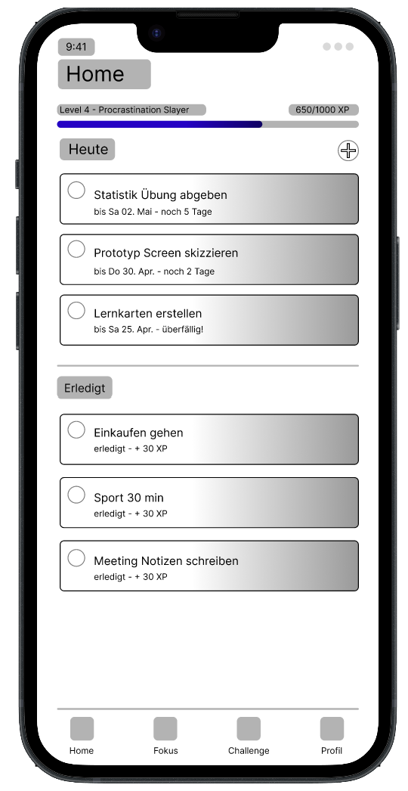

Der Home Screen zeigt die aktuellen Tasks sowie den allgemeinen Fortschritt des Nutzers.

#### Create Task Screen

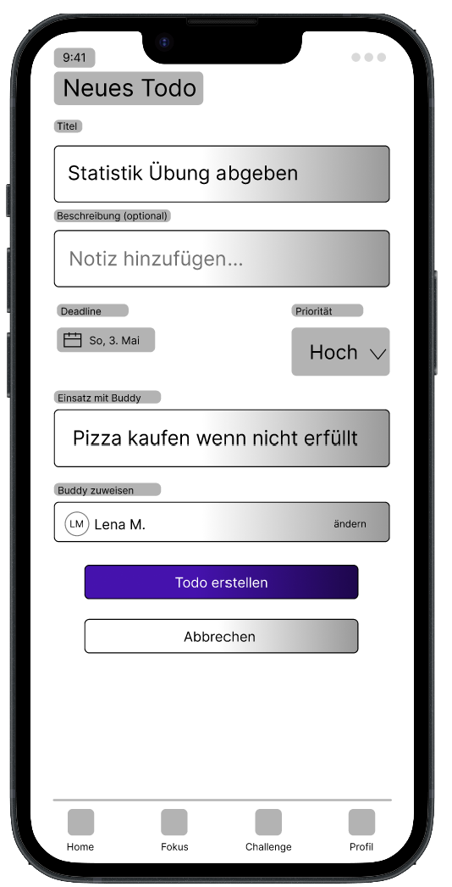

Über diesen Screen können neue Aufgaben erstellt werden.

#### Focus Screen

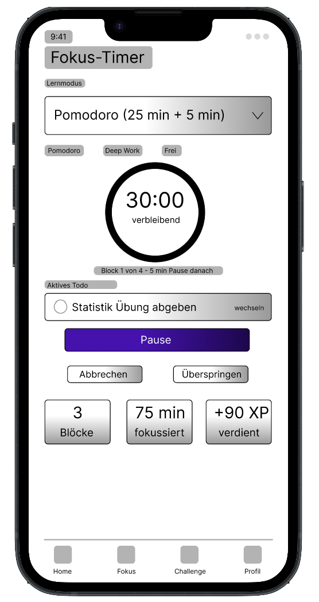

Der Fokus-Bereich unterstützt Nutzer beim konzentrierten Arbeiten mittels Timer.

#### Challenge Screen

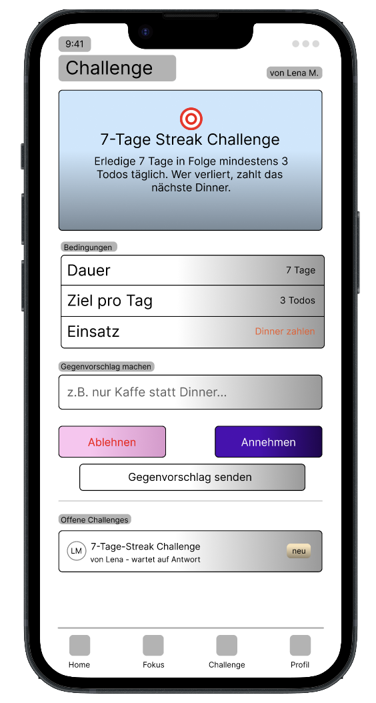

Beim Challenge-Screen sieht man eine Übersicht der laufenden Challenges und kann eingehende Challenges annehmen oder ablehnen.

#### Profile Screen

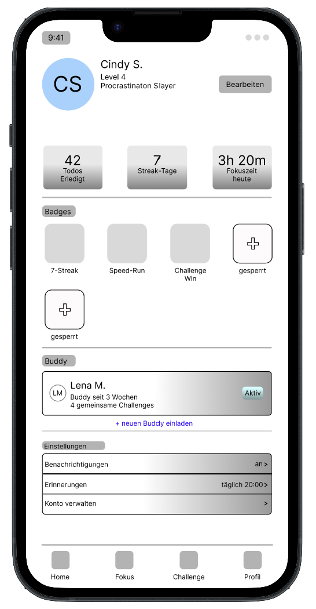

Im Profil werden Fortschritt, XP und Statistiken dargestellt.

### 3.4 Prototype

#### 3.4.1. Entwurf (Design)

- **Informationsarchitektur:** Die Anwendung wurde in mehrere klar voneinander getrennte Bereiche unterteilt, um eine einfache Navigation und eine intuitive Bedienung zu ermöglichen. Die finale Version besteht aus den Bereichen Home, Tasks, Focus, Buddy, Challenges und Profile. Jeder Bereich erfüllt eine spezifische Aufgabe und unterstützt den Nutzer dabei, seine Produktivität zu steigern und den Überblick über Aufgaben und Fortschritte zu behalten.

- **User Interface Design:** 
Die finale Version der Anwendung besteht aus sechs Hauptbereichen. Die folgenden Screenshots zeigen die wichtigsten Benutzeroberflächen und deren Funktion.

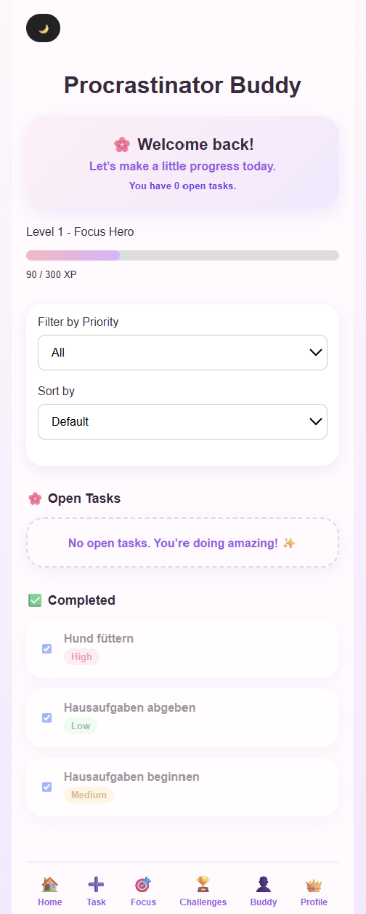

Die Home-Seite dient als zentrale Übersicht der Anwendung. Sie zeigt offene Aufgaben, den aktuellen Fortschritt des Nutzers, aktive Challenges sowie die XP-Anzeige.

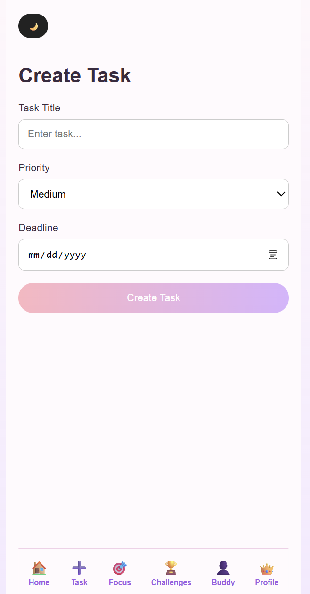
Auf der Task-Seite können Aufgaben erstellt, bearbeitet, gelöscht und abgeschlossen werden. Zusätzlich stehen Prioritäten, Deadlines sowie Filter- und Sortierfunktionen zur Verfügung.

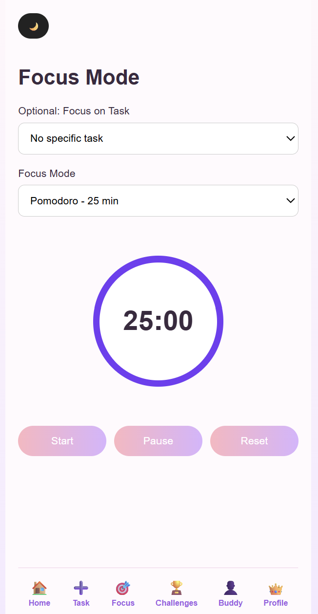
Der Fokus-Bereich unterstützt konzentriertes Arbeiten durch verschiedene Timer-Modi. Fokus-Sessions können direkt mit Aufgaben verknüpft werden.

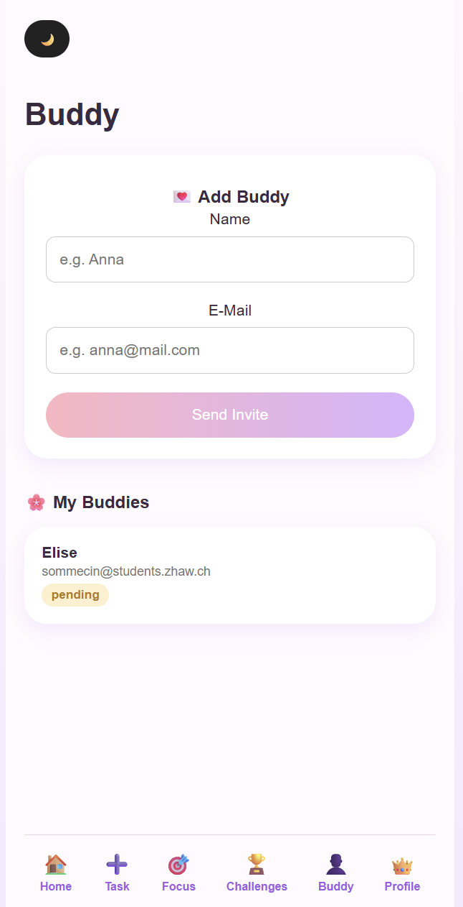
Die Buddy-Seite ermöglicht das Verwalten von Buddies und unterstützt die soziale Komponente der Anwendung.

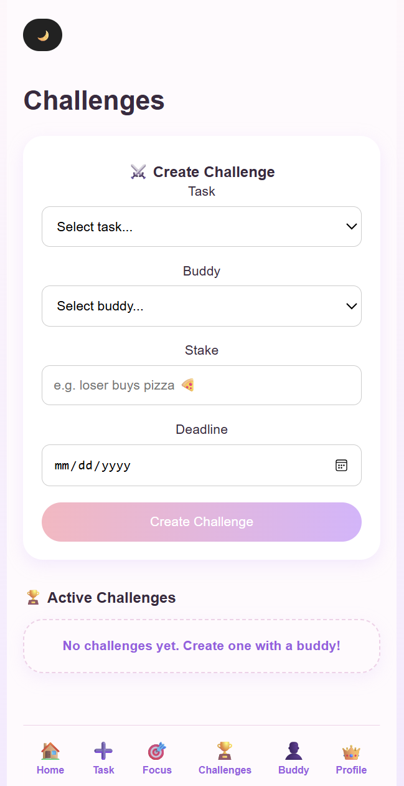
Challenges können mit Buddies erstellt und verwaltet werden. Nutzer können Challenges akzeptieren, abschliessen und als gewonnen oder verloren markieren.

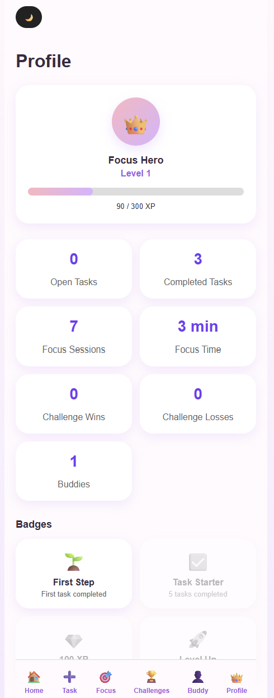
Das Profil zeigt den persönlichen Fortschritt des Nutzers. Dazu gehören XP, Levels, Badges, Fokuszeit sowie Challenge-Statistiken.

- **Designentscheidungen:** Bei der Gestaltung wurde ein Mobile-First-Ansatz verfolgt, da Produktivitäts-Apps häufig auf mobilen Geräten genutzt werden. Die Benutzeroberfläche verwendet helle Pastellfarben, um eine freundliche und motivierende Atmosphäre zu schaffen. Zusätzlich wurde ein Dark Mode implementiert, um die Nutzung bei unterschiedlichen Lichtverhältnissen zu unterstützen.

Ein weiteres wichtiges Ziel war eine möglichst einfache Navigation. Die wichtigsten Funktionen sind jederzeit über die untere Navigationsleiste erreichbar. Gamification-Elemente wie XP, Levels, Badges und Challenges wurden bewusst sichtbar integriert, um die Motivation der Nutzer langfristig zu fördern.

#### 3.4.2. Umsetzung (Technik)
Fasst die technische Realisierung zusammen.
- **Technologie-Stack:** Für die Umsetzung der Anwendung wurde SvelteKit verwendet. Die Benutzeroberfläche wurde mit HTML, CSS und JavaScript entwickelt. Die serverseitige Logik basiert auf den API-Routen von SvelteKit. Als Datenbank wurde MongoDB Atlas eingesetzt.

- **Tooling:** Für die Entwicklung wurden Visual Studio Code als Entwicklungsumgebung, Git und GitHub für die Versionsverwaltung sowie MongoDB Atlas für die Datenspeicherung verwendet. Die Mockups und frühen Entwürfe wurden in Figma erstellt.

- **Struktur & Komponenten:** Die Anwendung ist in mehrere Seiten und API-Routen aufgeteilt. Zu den wichtigsten Seiten gehören Home, Tasks, Focus, Buddy, Challenges und Profile. Die Kommunikation mit der Datenbank erfolgt über eigene API-Routen für Tasks, Buddies, Challenges und Fokus-Sessions.

- **Daten & Schnittstellen:** Alle relevanten Daten werden in MongoDB Atlas gespeichert. Dazu gehören Tasks, Buddies, Challenges und Fokus-Sessions. Die Daten werden über die SvelteKit API-Routen erstellt, gelesen, aktualisiert und gelöscht.

- **Deployment:** Die Anwendung wurde über Netlify veröffentlicht und ist unter folgender URL erreichbar: https://procrastinator-buddy.netlify.app/ 

- **Besondere Entscheidungen:** Während der Entwicklung wurde bewusst auf ein Login-System verzichtet. Dadurch konnte der Fokus auf die Kernfunktionalitäten der Anwendung gelegt werden. Dies ermöglichte eine schnellere Entwicklung und eine stärkere Konzentration auf die Aspekte Produktivität, Gamification und soziale Motivation.

### 3.5 Validate
- **URL der getesteten Version**: https://procrastinator-buddy.netlify.app/

_[Hinweis: Die formale Usability-Evaluation wurde mit Version 1 durchgeführt. Die späteren Versionen wurden iterativ auf Basis der Evaluationsergebnisse weiterentwickelt und nicht separat deployt.]_

- **Ziele der Prüfung:** Mit der Evaluation sollte überprüft werden, ob Nutzer die Navigation der App verstehen, neue Tasks erstellen können und die wichtigsten Funktionen ohne Unterstützung finden. Zusätzlich sollte untersucht werden, ob das XP-System verständlich ist, der Fokus-Timer intuitiv bedient werden kann und die Anwendung insgesamt als motivierend wahrgenommen wird.

- **Vorgehen:** Die Evaluation wurde als moderierter Usability-Test vor Ort durchgeführt. Die Testpersonen erhielten mehrere Aufgaben, welche sie selbstständig im Prototyp ausführen sollten. Während der Durchführung wurden Beobachtungen dokumentiert. Anschliessend wurden offene Fragen gestellt und qualitatives Feedback gesammelt.

- **Stichprobe:** Beide Testpersonen waren Studierende und gehören damit zur definierten Zielgruppe. Beide Personen verfügen über Erfahrung im Studium bzw. in der Organisation von Lern- und Arbeitsaufgaben und entsprechen damit der vorgesehenen Zielgruppe der Anwendung.

- **Aufgaben/Szenarien:** 
1. Aufgabe: Erstellen Sie einen neuen Task mit hoher Priorität und überprüfen Sie, ob dieser auf der Home-Seite erscheint.

2. Aufgabe: Starten Sie eine Fokus-Session und markieren Sie den bearbeiteten Task anschliessend als erledigt.

3. Aufgabe: Öffnen Sie die Profilseite und überprüfen Sie Ihren Fortschritt anhand der XP-Anzeige und der Anzahl erledigter Tasks.

4. Aufgabe: Löschen Sie einen bestehenden Task.

- **Kennzahlen & Beobachtungen:** 
* Anzahl Testpersonen: 2
* Erfolgsquote: 100 % (alle Aufgaben konnten abgeschlossen werden)
* Die Navigation wurde von beiden Testpersonen als verständlich wahrgenommen.
* Das Design wurde als übersichtlich und ansprechend bewertet.
* Die Testpersonen wünschten sich zusätzliche Motivationsmechanismen und mehr Komfortfunktionen.
* Es wurde vorgeschlagen, unterschiedliche XP-Werte je nach Priorität zu vergeben.
* Es wurde der Wunsch geäussert, Tasks bearbeiten zu können.
* Die Verknüpfung von Fokus-Sessions mit Tasks wurde als sinnvolle Erweiterung genannt.

- **Detaillierte Rückmeldungen der Testpersonen:**

### Detaillierte Rückmeldungen der Testpersonen

| Testperson | Positives Feedback | Probleme / Kritik | Ideen & Verbesserungsvorschläge | Unklarheiten |
|------------|-------------------|-------------------|---------------------------------|--------------|
| Andrea Brunetto | Gutes Design, klar und übersichtlich. Gute Verknüpfungen zwischen den Funktionen. Navigation verständlich. | Die Seite „Create Task“ wirkte noch etwas leer. | High-Priority-Tasks sollten mehr XP geben als Low-Priority-Tasks. Fokus-Modus mit Tasks verknüpfen. Mobile- und Desktop-Ansicht ermöglichen. | „Create“ sollte in „Task erstellen“ umbenannt werden. Delete-Button bei abgeschlossenen Tasks entfernen. |
| Muriele Stermcnik | Grundfunktionen verständlich. Navigation einfach. Fokus-Timer wurde als hilfreich wahrgenommen. | Tasks konnten nicht bearbeitet werden. Fokuszeit war nicht anpassbar. Einige Funktionen wirkten noch zu wenig flexibel. | Bearbeiten von Tasks ermöglichen. Fokuszeit individuell anpassbar machen. Fokus-Modus deutlicher anzeigen. Abschlussanimation nach Ablauf des Timers hinzufügen. | Wie werden XP berechnet? Kann die Fokuszeit individuell angepasst werden? |

- **Zusammenfassung der Resultate:** Die Evaluation zeigte, dass die grundlegenden Funktionen der Anwendung verständlich und einfach bedienbar sind. Insbesondere die Navigation und die Struktur der App wurden positiv bewertet. Gleichzeitig wurde deutlich, dass zusätzliche Gamification-Elemente sowie erweiterte Funktionen im Bereich Task Management und Fokus-Modus den Nutzen der Anwendung weiter erhöhen würden.

- **Abgeleitete Verbesserungen:** 

| Priorität | Verbesserung | Begründung |
|------------|-------------|------------|
| Hoch | XP-System nach Priorität | Direkter Wunsch der Testpersonen und stärkere Motivation |
| Hoch | Tasks bearbeiten | Erhöht die Benutzerfreundlichkeit bei Fehlern oder Änderungen |
| Hoch | Fokus-Sessions mit Tasks verknüpfen | Verbessert die Nachvollziehbarkeit des Arbeitsaufwands |
| Mittel | Erweiterung des Fokus-Timers | Mehr Flexibilität für unterschiedliche Arbeitsweisen |
| Mittel | Verbesserte Navigation und Beschriftungen | Erhöht die Verständlichkeit für neue Nutzer |
| Niedrig | Zusätzliche Gamification-Elemente (Badges, Challenges) | Steigert Motivation und langfristige Nutzung |

## 4. Erweiterungen

### 4.1 XP-System nach Priorität  
- **Beschreibung & Nutzen:** In der ursprünglichen Version erhielten alle abgeschlossenen Tasks dieselbe Anzahl XP. Das System wurde erweitert, sodass je nach Priorität unterschiedlich viele XP vergeben werden. Dadurch werden wichtige Aufgaben stärker belohnt und die Motivation erhöht.
- **Wo umgesetzt:** Frontend (XP-Berechnung auf der Home-Seite) sowie Backend bei der Verarbeitung der Task-Daten.
- **Referenz:** Kapitel 3.5 Validate – Verbesserungsvorschlag aus der Evaluation.
- **Aus Evaluation abgeleitet?:** Ja.

### 4.2 Task-Bearbeitung und Deadlines
- **Beschreibung & Nutzen:** Tasks können nachträglich bearbeitet und mit einer Deadline versehen werden. Dadurch können Nutzer Fehler korrigieren und ihre Aufgaben besser planen.
- **Wo umgesetzt:** Frontend (Bearbeitungsformular und Anzeige) sowie Backend und Datenbank zur Speicherung der zusätzlichen Informationen.
- **Referenz:** Screenshot der Task-Seite in Kapitel 3.4.
- **Aus Evaluation abgeleitet?:** Ja.

### 4.3 Fokuszeit pro Task
- **Beschreibung & Nutzen:** Fokus-Sessions können einem Task zugeordnet werden. Die aufgewendete Fokuszeit wird gespeichert und direkt beim Task angezeigt. Dadurch erhalten Nutzer einen besseren Überblick über ihren tatsächlichen Arbeitsaufwand.
- **Wo umgesetzt:** Frontend (Focus-Seite und Home-Seite), Backend (Focus-Session API) und Datenbank.
- **Referenz:** Kapitel 3.4 Focus Screen.
- **Aus Evaluation abgeleitet?:** Ja.

### 4.4 Buddy-System
- **Beschreibung & Nutzen:** Nutzer können Buddies hinzufügen und verwalten. Das Buddy-System bildet die Grundlage für soziale Motivation und gemeinsame Challenges.
- **Wo umgesetzt:** Frontend, Backend API und MongoDB-Datenbank.
- **Referenz:** Kapitel 3.4 Buddy Screen.
- **Aus Evaluation abgeleitet?:** Nein.

### 4.5 Challenge-System
- **Beschreibung & Nutzen:** Nutzer können Challenges mit Buddies erstellen und verwalten. Challenges können mit konkreten Tasks verknüpft und als gewonnen oder verloren markiert werden. Dadurch wird die Motivation durch spielerische Elemente erhöht.
- **Wo umgesetzt:** Frontend, Backend API und MongoDB-Datenbank.
- **Referenz:** Kapitel 3.4 Challenge Screen.
- **Aus Evaluation abgeleitet?:** Nein.

### 4.6 Gamification-Erweiterungen
- **Beschreibung & Nutzen:** Das bestehende XP-System wurde durch Levels, Badges, Wins & Losses sowie Fortschrittsanzeigen erweitert. Diese Elemente erhöhen die Motivation und machen Fortschritte sichtbar.
- **Wo umgesetzt:** Frontend sowie Datenbank zur Speicherung relevanter Informationen.
- **Referenz:** Kapitel 3.4 Profile Screen.
- **Aus Evaluation abgeleitet?:** Teilweise.

### 4.7 Filter- und Sortierfunktionen
- **Beschreibung & Nutzen:** Aufgaben können nach Priorität gefiltert und nach Deadline sortiert werden. Dadurch finden Nutzer wichtige Aufgaben schneller und können ihre Arbeit besser priorisieren.
- **Wo umgesetzt:** Frontend auf der Home-Seite.
- **Referenz:** Kapitel 3.4 Home Screen.
- **Aus Evaluation abgeleitet?:** Teilweise.

### 4.8 Dark Mode
- **Beschreibung & Nutzen:** Die Anwendung unterstützt sowohl einen Light Mode als auch einen Dark Mode. Dadurch wird die Nutzung bei unterschiedlichen Lichtverhältnissen angenehmer.
- **Wo umgesetzt:** Frontend (CSS und Theme-Umschaltung).
- **Referenz:** Kapitel 3.4 User Interface Design.
- **Aus Evaluation abgeleitet?:** Nein.

### 4.9 Fokus-Statistiken
- **Beschreibung & Nutzen:** Die Anwendung speichert die Anzahl der Fokus-Sessions sowie die gesamte Fokuszeit. Diese Informationen werden auf der Profilseite angezeigt und unterstützen die Selbstreflexion der Nutzer.
- **Wo umgesetzt:** Frontend, Backend API und Datenbank.
- **Referenz:** Kapitel 3.4 Profile Screen.
- **Aus Evaluation abgeleitet?:** Nein.

### 4.10 Animiertes Feedback
- **Beschreibung & Nutzen:** Beim Abschluss eines Tasks wird eine Animation eingeblendet. Dadurch erhalten Nutzer direktes positives Feedback für ihre Leistung.
- **Wo umgesetzt:** Frontend.
- **Referenz:** Kapitel 3.4 Home Screen.
- **Aus Evaluation abgeleitet?:** Nein.

## 5. Projektorganisation
- **Repository & Struktur:** Der Quellcode wurde in einem GitHub-Repository verwaltet und versioniert. Die Anwendung wurde mit SvelteKit entwickelt und folgt einer klaren Projektstruktur mit getrennten Bereichen für Frontend, API-Routen und Datenbankanbindung.

**Repository & Struktur:**
https://github.com/cin614/procrastinator-buddy.git

Wichtige Projektbestandteile:
* src/routes – Seiten der Anwendung (Home, Tasks, Focus, Buddy, Challenges, Profile)
* src/routes/api – API-Routen für Tasks, Buddies, Challenges und Fokus-Sessions
* src/lib – Wiederverwendbare Komponenten und Datenbankanbindung
* documentation – Projektdokumentation und Screenshots

Die Anwendung wurde über Netlify deployed und ist unter folgender URL erreichbar:

https://procrastinator-buddy.netlify.app/

- **Issue-Management:** Das Projekt wurde als Einzelprojekt durchgeführt. Die Planung und Priorisierung der Aufgaben erfolgte iterativ. Neue Anforderungen entstanden durch die Usability-Evaluation sowie während der Entwicklung. Verbesserungen wurden schrittweise umgesetzt und anschliessend getestet.

Zu den wichtigsten Entwicklungsaufgaben gehörten:
* Implementierung des XP-Systems
* Erweiterung der Task-Verwaltung
* Integration von Fokus-Sessions
* Entwicklung des Buddy-Systems
* Entwicklung des Challenge-Systems
* Einführung von Badges, Levels und Statistiken
* Optimierung der Benutzeroberfläche  

- **Commit-Praxis:** Während der Entwicklung wurde Git zur Versionsverwaltung eingesetzt. Änderungen wurden regelmässig in kleinen Schritten gespeichert und mit sprechenden Commit-Messages dokumentiert.

Beispiele für Commit-Messages:
* Added task editing functionality
* Implemented focus session tracking
* Added buddy system
* Implemented challenge management
* Added dark mode
* Updated profile statistics

Durch die regelmässigen Commits konnten Änderungen nachvollzogen und bei Bedarf wiederhergestellt werden.

## 6. KI-Deklaration
Die folgende Deklaration beschreibt den Einsatz von KI-Werkzeugen während der Entwicklung des Projekts „Procrastinator Buddy“.

### 6.1 KI-Tools
- **Eingesetzte Tools**: Während des Projekts wurde hauptsächlich ChatGPT (OpenAI) eingesetzt. Die KI wurde während der Ideenfindung, Konzeption, Entwicklung und Dokumentation unterstützend verwendet.

- **Zweck & Umfang**: ChatGPT wurde für folgende Aufgaben genutzt:

* Ideenfindung und Brainstorming
* Unterstützung bei der Ausarbeitung des Konzepts
* Diskussion von Design- und Architekturentscheidungen
* Erstellung von Codevorschlägen
* Unterstützung bei Fehleranalyse und Debugging
* Refactoring bestehender Funktionen
* Unterstützung bei der Erstellung von API-Routen
* Formulierung von Texten für die Projektdokumentation
* Verbesserung von Benutzeroberflächen und User Experience
* Unterstützung bei der Interpretation der Ergebnisse aus der Usability-Evaluation

Einzelne Codeabschnitte und Lösungsansätze wurden teilweise auf Basis von KI-Vorschlägen erstellt und anschliessend in das Projekt integriert.

- **Eigene Leistung (Abgrenzung):** Die Konzeption der Anwendung, die Auswahl der Funktionen, die Entscheidungen bezüglich Design und Architektur sowie die finale Implementierung wurden eigenständig durchgeführt.

Alle KI-generierten Vorschläge wurden überprüft, angepasst und in den bestehenden Code integriert. Die Verantwortung für die technische Umsetzung, die Fehlerbehebung, die Tests sowie die finale Ausgestaltung der Anwendung lag vollständig bei der Projektverfasserin.

### 6.2 Prompt-Vorgehen
Die Zusammenarbeit mit der KI erfolgte iterativ. Anstatt komplette Lösungen anzufordern, wurden einzelne Probleme, Funktionen oder Verbesserungsideen schrittweise diskutiert.

- Typische Fragestellungen betrafen:
* Umsetzung bestimmter Funktionen in SvelteKit
* Datenmodellierung in MongoDB
* Verbesserung der Benutzeroberfläche
* Erweiterung des Gamification-Systems
* Dokumentation und Formulierungen

Die Vorschläge der KI wurden jeweils kritisch geprüft und an die Anforderungen des Projekts angepasst. Generierte Inhalte wurden nicht ungeprüft übernommen.

Bei der Erstellung der Dokumentation wurde darauf geachtet, dass die Inhalte den tatsächlichen Projektverlauf korrekt widerspiegeln. Externe Quellen wurden nicht durch die KI ersetzt.

### 6.3 Reflexion
Der Einsatz von KI ermöglichte eine schnellere Entwicklung und unterstützte insbesondere bei technischen Fragestellungen, der Fehlersuche und der Ausarbeitung von Ideen. Dadurch konnten verschiedene Lösungsansätze effizient verglichen und bewertet werden.

Gleichzeitig zeigte sich, dass KI-generierte Vorschläge nicht immer fehlerfrei oder optimal für das konkrete Projekt geeignet waren. Eine sorgfältige Überprüfung und Anpassung der Ergebnisse war daher notwendig. Besonders bei komplexeren Funktionen mussten Vorschläge getestet und teilweise mehrfach überarbeitet werden.

Insgesamt stellte die KI ein hilfreiches Unterstützungswerkzeug dar, ersetzte jedoch nicht die eigene Analyse, Entscheidungsfindung und Implementierung.

## 7. Anhang
- **Quellen:** Für die Umsetzung des Projekts wurden folgende Quellen und Werkzeuge verwendet:
* SvelteKit Dokumentation: https://kit.svelte.dev/
* MongoDB Atlas Dokumentation: https://www.mongodb.com/docs/
* Figma für Mockups und Prototyping
* Netlify für das Deployment
* ChatGPT (OpenAI) als unterstützendes Entwicklungswerkzeug

Es wurden keine urheberrechtlich geschützten Bilder, Icons oder Templates von Drittanbietern übernommen.

- **Testskript & Materialien:** Für die Usability-Evaluation wurden folgende Materialien erstellt:

* Usability-Testskript
* Testaufgaben und Szenarien
* Dokumentation der Testdurchführung
* Dokumentation der Ergebnisse

Die vollständigen Unterlagen befinden sich in der Projektdokumentation bzw. im Repository.

- **Rohdaten/Auswertung:** Die Ergebnisse der Evaluation wurden dokumentiert und ausgewertet.

Enthalten sind:
* Rückmeldungen der Testpersonen
* Beobachtungen während der Tests
* Identifizierte Verbesserungspotenziale
* Abgeleitete Anforderungen für spätere Versionen

- **Prototypen & Entwicklung:** Im Verlauf des Projekts wurden mehrere Versionen entwickelt und iterativ verbessert:

* Version 1: 
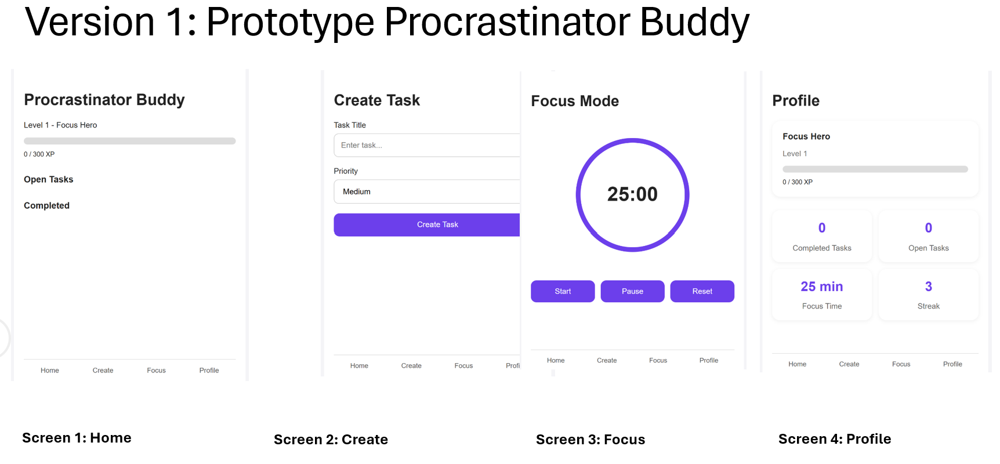
Die erste Version enthielt die Grundfunktionen Home, Create, Focus und Profile.

* Version 2: 
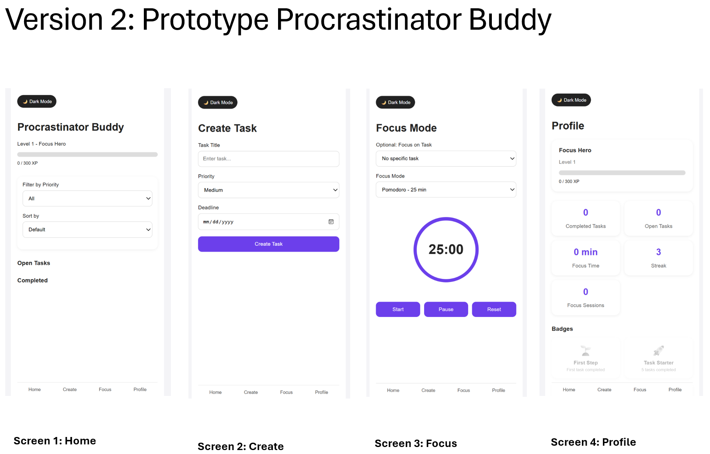
Basierend auf dem Usability-Test wurden erste Verbesserungen an Navigation und Benutzeroberfläche vorgenommen.

* Version 3: 
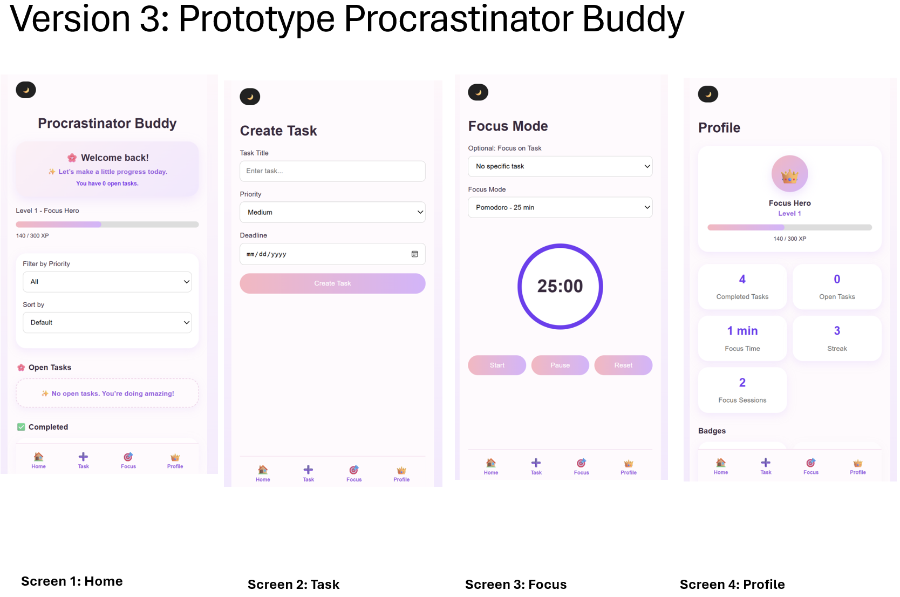
Die Task-Verwaltung wurde erweitert und zusätzliche Produktivitätsfunktionen integriert.

* Version 4: 
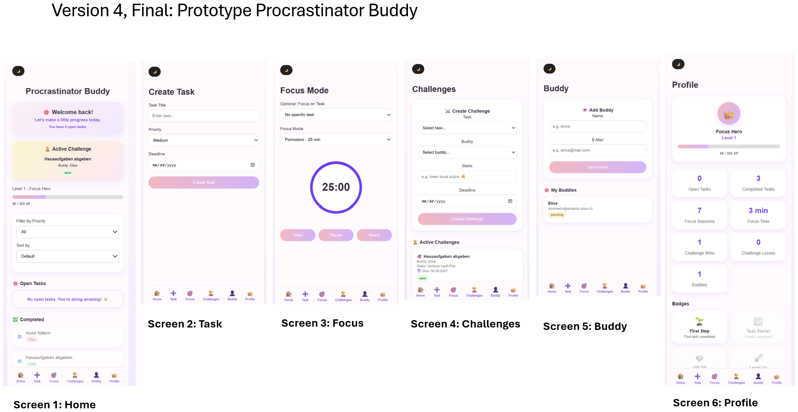
Die finale Version enthält die Bereiche Home, Tasks, Focus, Buddy, Challenges und Profile sowie Gamification- und Social-Features.

- **Zusätzliche Dokumente:**  
* Prototype-Versionen.docx
* Usability-Tests.docx

Die vollständigen Rohnotizen und Testunterlagen der Evaluation befinden sich zusätzlich in den oben genannten Dokumenten.

- **Links:** 
* Figma Prototype: https://www.figma.com/proto/2LwpM2jr5oM9jmk7dvOfdl/Woche-10?node-id=0-1&t=fHcpGsZvtTT7VHJP-1

* Figma Dev Mode: https://www.figma.com/design/2LwpM2jr5oM9jmk7dvOfdl/Woche-10?node-id=0-1&m=dev&t=fHcpGsZvtTT7VHJP-1

* Deployment (Netlify): https://procrastinator-buddy.netlify.app/

